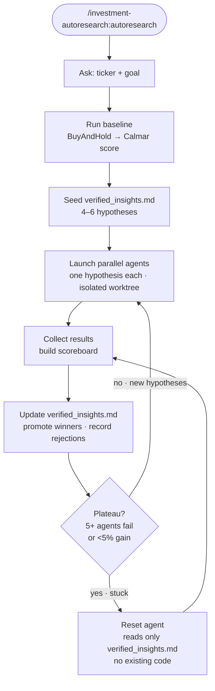

# investment-autoresearch

A Claude Code plugin for trading strategy research via parallel agent experimentation.

Inspired by [Ryan Li's Paradigm Hackathon methodology](https://x.com/ryanli_me) — 1,039 variants tested across 8–20 parallel agents with periodic resets.

## What it does

Runs a structured search loop over trading strategy variants:

1. Ask two questions (ticker + goal), then auto-handle everything else
2. Establish a buy-and-hold baseline
3. Seed hypotheses into `verified_insights.md`
4. Launch 4–10 parallel agents, each testing ONE hypothesis in an isolated git worktree
5. Collect results, update insights, decide: explore more or reset
6. When stuck, spawn a fresh agent that reads only `verified_insights.md` — no existing code

The reset step is the key move. Existing code anchors thinking. Fresh agents find architectures incremental optimization cannot reach.



**In practice:** QQQ went from Calmar 0.45 (buy-and-hold) to **Calmar 1.02** in two sessions, 8 total backtests. See the [live demo archive](archive/qqq-autoresearch-v2/) and [full walkthrough](docs/demo-walkthrough.md).

## What it looks like

```
/investment-autoresearch:autoresearch

  What ticker? → QQQ
  Higher returns or limiting losses? → limiting losses

  ✓ Baseline: BuyAndHold — Ann. 15.3%, MaxDD -34.2%, Calmar 0.45
  ✓ Seeded 5 hypotheses → archive/qqq-autoresearch-v1/verified_insights.md
  ↗ Launching 5 agents in parallel...

  [agent 1]  testing GoldenCross_50_200 ...........  ✓  Calmar 0.46  BEAT
  [agent 2]  testing RsiFilter ..................... ✓  Calmar 0.01  WORSE
  [agent 3]  testing MomentumFilter3M ............. ✓  Calmar 0.34  WORSE
  [agent 4]  testing PriceAbove200Sma ............. ✓  Calmar 1.02  BEAT ↑
  [agent 5]  testing VolatilityExit ............... ✓  Calmar 0.28  WORSE

  Winner promoted → strategies/qqq/PriceAbove200Sma.py
  Insights updated → archive/qqq-autoresearch-v1/verified_insights.md
  Next: run /investment-autoresearch:autoresearch again to continue from here
```

## Skills

| Trigger | Description |
|---|---|
| `/investment-autoresearch:autoresearch` | Core parallel loop — two questions, then baseline → agents → insights → repeat |
| `/investment-autoresearch:parse` | Parse agent results into structured JSON + walk-forward backtests |
| `/investment-autoresearch:report` | Generate a markdown report from `autoresearch_result.json` |
| `/investment-autoresearch:strategy-chart` | Generate matplotlib strategy chart saved to `/tmp/chart.png` |

## Prerequisites

- [Claude Code](https://claude.ai/code)
- git 2.5+ (required for isolated worktrees)
- Python 3.9+ with `backtesting` and `yfinance` installed

## Installation

```bash
git clone https://github.com/lucemia/investment-autoresearch ~/.claude/plugins/cache/lucemia/investment-autoresearch
pip install backtesting yfinance
```

Then restart Claude Code — it will auto-discover the plugin from the cache directory.

To update later: `git -C ~/.claude/plugins/cache/lucemia/investment-autoresearch pull`

> Once listed in the Claude Code marketplace, installation will simplify to: `claude plugin install gh:lucemia/investment-autoresearch`

## Usage

### 1. Run autoresearch

```
/investment-autoresearch:autoresearch
```

Claude asks two questions — ticker and goal — then handles everything automatically: baseline run, hypothesis seeding, parallel agents, result collection, winner promotion.

### 2. Parse results

```
/investment-autoresearch:parse
```

Runs walk-forward backtests across 1y/2y/3y/5y and produces `autoresearch_result.json`.

### 3. Generate report

```
/investment-autoresearch:report
```

Produces a structured markdown report from `autoresearch_result.json`.

### 4. Visualize

```
/investment-autoresearch:strategy-chart
```

Generates a 3-panel matplotlib chart (price + equity curve, drawdown, VIX) saved to `/tmp/chart.png`.

## Folder convention

All research output goes under `archive/{ticker}-autoresearch-v{N}/`. Each session auto-increments N.

```
archive/
└── qqq-autoresearch-v2/
    ├── verified_insights.md           ← cumulative state: baseline, confirmed, rejected, next hypotheses
    ├── AGENT_R1_H5_RESULTS.md         ← one file per agent/hypothesis
    ├── AGENT_R1_H6_RESULTS.md
    ├── AGENT_R1_H7_RESULTS.md
    ├── AGENT_R1_H8_RESULTS.md
    └── autoresearch_result.json       ← parsed + walk-forward metrics (from /investment-autoresearch-parse)
```

`verified_insights.md` is the state machine of the loop — it carries every confirmed principle and rejection forward across sessions. New sessions seed from the previous session's file.

## Demo

The `archive/` folder in this repo contains a live QQQ run across two sessions:

- [`archive/qqq-autoresearch-v1/`](archive/qqq-autoresearch-v1/) — Round 1: 4 strategies, BuyAndHold → SmaCross_50_200 (Calmar 0.45 → 0.46)
- [`archive/qqq-autoresearch-v2/`](archive/qqq-autoresearch-v2/) — Round 2: 4 strategies, SmaCross_50_200 → PriceAbove200Sma (Calmar 0.46 → 1.02)

See [docs/demo-walkthrough.md](docs/demo-walkthrough.md) for the full annotated walkthrough.

## Running tests

```bash
pip install pytest
python3 -m pytest tests/ -v
```

## License

MIT
