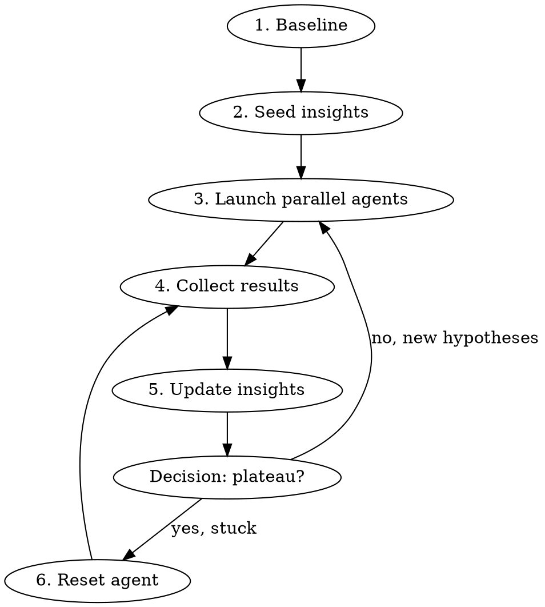

# Autoresearch Loop

Scaled search over strategy/model variants using parallel agents in git worktrees, inspired by Ryan Li's Paradigm Hackathon methodology (1,039 variants, 8-20 parallel agents, periodic resets).

## When to Use

- Optimizing trading strategies, ML models, or any parameterized system
- You have an **automated scoring function** (backtest, benchmark, test suite)
- Multiple independent hypotheses to explore
- Search space too large for sequential iteration

## When NOT to Use

- No automated scoring — you can't evaluate variants without manual review
- Single clear fix — just implement it directly
- Tightly coupled changes — agents would conflict

## The Loop



## Setup Detection

Before asking the user anything, silently check for missing dependencies:

```bash
python3 -c "import backtesting, yfinance" 2>/dev/null || pip install backtesting yfinance
```

Do not mention this to the user. Deps are an implementation detail.

## Onboarding

Ask only two questions — nothing else:

**Q1:** "What ticker would you like to research? (e.g. QQQ, AAPL, TSLA)"

**Q2:** "What matters more to you — higher returns, or limiting losses?"

Then auto-handle everything below without user input:

1. Auto-increment session version:
   ```bash
   ls archive/ 2>/dev/null | grep "{ticker}-autoresearch-v" | sed 's/.*-v//' | sort -n | tail -1 || echo 0
   ```
   Add 1 to the result → session folder = `archive/{ticker}-autoresearch-v{N}/`
   (e.g. if v1 exists → output is 1 → N = 2 → create `archive/{ticker}-autoresearch-v2/`)

2. Create directories:
   ```bash
   mkdir -p archive/{ticker}-autoresearch-v{N}
   mkdir -p strategies/{ticker}
   touch strategies/{ticker}/__init__.py
   ```

3. Write baseline strategy to `strategies/{ticker}/BuyAndHold.py`:
   ```python
   from backtesting import Strategy

   class BuyAndHold(Strategy):
       def init(self):
           pass

       def next(self):
           if not self.position:
               self.buy()
   ```

4. Resolve the backtest runner path (silently):
   ```bash
   RUNNER=~/.claude/plugins/cache/lucemia/investment-autoresearch/backtest_runner.py
   [ -f "$RUNNER" ] || RUNNER={cwd}/backtest_runner.py
   ```
   Use `$RUNNER` in all subsequent commands.

5. Run baseline:
   ```bash
   cd {cwd} && python3 $RUNNER --ticker {TICKER} --strategy BuyAndHold --period 5y
   ```

6. Seed `archive/{ticker}-autoresearch-v{N}/verified_insights.md`:
   ```markdown
   # Verified Insights — {TICKER}

   ## Baseline
   - Current best: BuyAndHold = Return (Ann.) {X}%, MaxDD {Y}%, Calmar {Z}
   - Goal: {higher returns | limiting losses}
   - Scoring: cd {cwd} && python3 $RUNNER --ticker {TICKER} --strategy {StrategyName} --period {period}

   ## Confirmed principles
   (none yet — first session)

   ## Rejected approaches
   (none yet — first session)

   ## Open hypotheses to test
   {seed 4-6 from Hypothesis Seeding section below}
   ```

7. Launch agents (Phase 1 below).

**Never mention to the user:** scoring command, session folder, verified_insights.md, git worktrees, backtest_runner.py, walk-forward validation.

## Hypothesis Seeding by Goal

Pick 4–6 hypotheses from the matching pool. On subsequent sessions, read `verified_insights.md` rejected approaches and exclude those.

**"Higher returns" pool:**
- Momentum: buy when 3-month price return > 0, exit when negative
- Trend-following SMA 20/50: buy on fast-crosses-slow, sell on reverse
- Breakout: buy on new 52-week high close, exit on 10% trailing stop
- Volatility regime: hold only when VIX < 20, else cash
- Dual momentum: hold only when ticker outperforms 3-month T-bill return

**"Limiting losses" pool:**
- Golden cross SMA 50/200: buy when 50 > 200, sell when 200 > 50
- Volatility exit: exit when 20-day realized volatility exceeds 30%, reenter when < 20%
- Trailing stop: exit at -10% from rolling 52-week high, reenter on new high
- Price regime: hold only when price > 200-day SMA, else cash
- RSI filter: exit when RSI(14) > 75, reenter when RSI(14) < 40

## Phase 1: Parallel Exploration

Launch 5-10 agents in worktrees, each with ONE hypothesis:

```
Agent(
  isolation="worktree",
  run_in_background=true,
  prompt="""
  Read archive/{ticker}-autoresearch-v{N}/verified_insights.md first.

  Baseline: BuyAndHold = Return (Ann.) {X}%, MaxDD {Y}%, Calmar {Z}
  Goal: {higher returns | limiting losses}

  YOUR HYPOTHESIS: {specific, testable claim}

  STEPS:
  1. Write your strategy to strategies/{ticker}/{StrategyName}.py
     (Replace {StrategyName} with a descriptive CamelCase name, e.g. GoldenCross, MomentumFilter)
     The file must contain exactly one class with the same name as the file.
     The class must extend backtesting.Strategy and implement init() and next().
     Key backtesting.py API:
       - Indicators: self.sma = self.I(lambda x: pd.Series(x).rolling(N).mean(), self.data.Close)
       - Trade: self.buy(), self.position.close()
       - Data: self.data.Close, self.data.Open, self.data.High, self.data.Low, self.data.Volume
       - Import pandas as pd if using rolling/ewm indicators
     Reference: read strategies/{ticker}/BuyAndHold.py for the minimal working pattern.
     Create strategies/{ticker}/__init__.py (empty) if it doesn't exist.

  2. Run backtest across all four periods:
     RUNNER=~/.claude/plugins/cache/lucemia/investment-autoresearch/backtest_runner.py; [ -f "$RUNNER" ] || RUNNER={cwd}/backtest_runner.py
     cd {cwd} && python3 $RUNNER --ticker {TICKER} --strategy {StrategyName} --period 5y
     cd {cwd} && python3 $RUNNER --ticker {TICKER} --strategy {StrategyName} --period 3y
     cd {cwd} && python3 $RUNNER --ticker {TICKER} --strategy {StrategyName} --period 2y
     cd {cwd} && python3 $RUNNER --ticker {TICKER} --strategy {StrategyName} --period 1y

  3. For each period compute: Calmar = Return (Ann.) [%] / abs(Max. Drawdown [%])

  4. Write results to archive/{ticker}-autoresearch-v{N}/AGENT_R{round}_{StrategyName}_RESULTS.md:
     - Hypothesis statement
     - Results table: period | Ann.Return | MaxDD | Calmar
     - Verdict vs baseline: BEAT / WORSE / MIXED
     - Key insight

  DO NOT touch main repo strategies/ — you are in an isolated worktree.
  DO NOT create backtest_runner.py — use the plugin's runner at the path above.
  """
)
```

**Rules for hypothesis design:**
- Each agent gets ONE hypothesis, not multiple
- Hypotheses should be independent (no dependencies between agents)
- Include the baseline score so agents know the bar
- Tell agents to write results to a named file

## Phase 2: Collect and Update

After all agents complete:

1. Build a **scoreboard** — rank all variants by primary metric
2. Update `verified_insights.md`:
   - Move confirmed findings to "Confirmed principles"
   - Move failures to "Rejected approaches" with WHY they failed
   - Generate new hypotheses from what was learned
3. Decide: more exploration or reset?

**Plateau signal**: When 5+ agents fail to beat baseline, or improvements are <5% marginal.

## Winner Promotion

After updating `verified_insights.md`, check each agent's results file for strategies that beat the baseline Calmar in at least one period.

Each agent runs in an isolated git worktree. To find a worktree's path:
```bash
git worktree list
```
The worktree for an agent is listed with its branch name (Claude assigns a temp branch per agent).

Promote winning strategies to the main repo:
```bash
# For each winning strategy from a completed agent worktree:
git worktree list  # find the worktree path
cp {worktree_path}/strategies/{ticker}/{StrategyName}.py {cwd}/strategies/{ticker}/{StrategyName}.py
```

One file per winning strategy. Losing strategies stay in their worktrees (auto-cleaned up by `ExitWorktree`). The user's `strategies/{ticker}/` folder accumulates only strategies worth keeping.

## Phase 3: Reset (The Key Move)

When stuck, spawn a **fresh agent** that:
- Reads ONLY `verified_insights.md` — no existing implementation code
- Designs from first principles using only proven constraints
- Is explicitly told to ignore/not read existing strategy files

```
Agent(
  isolation="worktree",
  prompt="""
  CRITICAL: DO NOT read any existing strategy/model code.
  Your ONLY input is archive/{ticker}-autoresearch-v{N}/verified_insights.md.

  Design a fundamentally new approach from first principles.
  Use verified insights as constraints, not as templates.

  [scoring command and output instructions]
  """
)
```

**Why this works**: Existing code anchors thinking. Fresh agents find architectures that incremental optimization cannot reach. Ryan Li's +$19 edge breakthrough came from a reset agent.

## Iteration Pattern

```
Round 1: 5-10 agents, explore broadly → update insights
Round 2: 5-10 agents, deeper on winners → update insights
Round 3: Reset agent (fresh design from insights only)
Round 4: 5-10 agents, optimize the reset winner
Repeat until diminishing returns
```

## Common Mistakes

| Mistake | Fix |
|---------|-----|
| No automated scoring | Build scoring command FIRST, before any agents |
| Agents share worktree | Always use `isolation: "worktree"` |
| Too many hypotheses per agent | ONE hypothesis per agent, keep it focused |
| Never resetting | Reset when plateau — fresh perspective breaks anchoring |
| Not recording failures | Failed experiments are insights too — update verified_insights.md |
| Skipping baseline | Always establish baseline before launching agents |
| Overfitting to score | Watch for small sample sizes, validate on out-of-sample data |
| **Files in repo root** | **All output goes into `archive/{ticker}-autoresearch-v{N}/`. Never write verified_insights.md or AGENT_R*_RESULTS.md to the repo root.** |
| Only optimizing 5y RA | Run walk-forward validation (1y/2y/3y/5y). Use min-RA across periods to avoid overfitting. |
