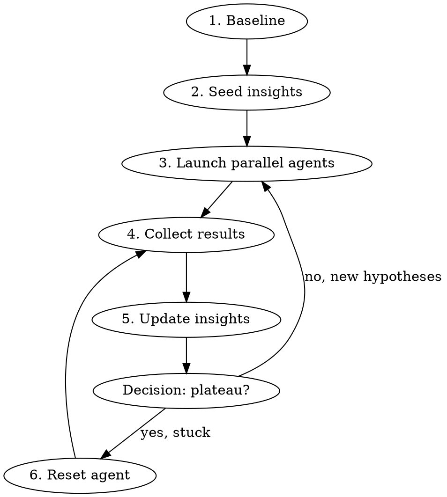

# Autoresearch Loop

Scaled search over strategy/model variants using parallel agents in git worktrees, inspired by Ryan Li's Paradigm Hackathon methodology (1,039 variants, 8-20 parallel agents, periodic resets).

## When to Use

- Optimizing trading strategies, ML models, or any parameterized system
- You have an **automated scoring function** (backtest, benchmark, test suite)
- Multiple independent hypotheses to explore
- Search space too large for sequential iteration

## When NOT to Use

- No automated scoring — you can't evaluate variants without manual review
- Single clear fix — just implement it directly
- Tightly coupled changes — agents would conflict

## The Loop



## Setup Requirements

Before starting, you need:

1. **Scoring command**: Single command that outputs a comparable metric
   ```bash
   # Example: backtest that outputs Return (Ann.) [%] and Max. Drawdown [%]
   YOUR_BACKTEST_COMMAND --ticker SOXL --strategy MyStrategy
   ```

2. **Baseline numbers**: Run scoring on current best to establish the bar

3. **Name the session folder** and create it:

   ```bash
   # New session: auto-increment version from existing folders
   ls archive/ | grep {ticker}-autoresearch   # check existing: v1, v2, ...
   mkdir -p archive/{ticker}-autoresearch-v{N}
   ```

   Session folder naming: `archive/{ticker}-autoresearch-v{N}` where N increments per session.
   Example: `soxl-autoresearch-v1/`, `soxl-autoresearch-v2/`, `soxl-autoresearch-v3/`

   **All output files go into the session folder — never the repo root.**
   - `verified_insights.md` → `archive/{ticker}-autoresearch-v{N}/verified_insights.md`
   - Agent result files → `archive/{ticker}-autoresearch-v{N}/AGENT_R{N}_RESULTS.md`

   **IMPORTANT — Seeding from prior sessions:**
   - Before creating a new session, check the latest prior session folder for `verified_insights.md`.
   - Copy it into the new session folder as the starting point: all prior confirmed principles and rejections carry forward.
   - Clear "Open hypotheses" and update "Baseline" to reflect the new session's starting point.

   ```markdown
   # Verified Insights — [Ticker/Project]

   ## Baseline
   - Current best: [strategy/model] = [score]
   - Buy & hold / naive baseline = [score]

   ## Confirmed principles
   1. [What works and why]

   ## Rejected approaches
   1. [What failed and why]

   ## Open hypotheses to test
   - [Hypothesis A]
   - [Hypothesis B]
   ```

## Phase 1: Parallel Exploration

Launch 5-10 agents in worktrees, each with ONE hypothesis:

```
Agent(
  isolation="worktree",
  run_in_background=true,
  prompt="""
  Read archive/{ticker}-autoresearch-v{N}/verified_insights.md first.
  Baseline: [current best] = [score].

  YOUR HYPOTHESIS: [specific, testable claim]

  STEPS:
  1. Implement the variant
  2. Run: [scoring command]
  3. Report: full comparison table
  4. Write results to archive/{ticker}-autoresearch-v{N}/AGENT_R[X]_RESULTS.md
  """
)
```

**Rules for hypothesis design:**
- Each agent gets ONE hypothesis, not multiple
- Hypotheses should be independent (no dependencies between agents)
- Include the baseline score so agents know the bar
- Tell agents to write results to a named file

## Phase 2: Collect and Update

After all agents complete:

1. Build a **scoreboard** — rank all variants by primary metric
2. Update `verified_insights.md`:
   - Move confirmed findings to "Confirmed principles"
   - Move failures to "Rejected approaches" with WHY they failed
   - Generate new hypotheses from what was learned
3. Decide: more exploration or reset?

**Plateau signal**: When 5+ agents fail to beat baseline, or improvements are <5% marginal.

## Phase 3: Reset (The Key Move)

When stuck, spawn a **fresh agent** that:
- Reads ONLY `verified_insights.md` — no existing implementation code
- Designs from first principles using only proven constraints
- Is explicitly told to ignore/not read existing strategy files

```
Agent(
  isolation="worktree",
  prompt="""
  CRITICAL: DO NOT read any existing strategy/model code.
  Your ONLY input is archive/{ticker}-autoresearch-v{N}/verified_insights.md.

  Design a fundamentally new approach from first principles.
  Use verified insights as constraints, not as templates.

  [scoring command and output instructions]
  """
)
```

**Why this works**: Existing code anchors thinking. Fresh agents find architectures that incremental optimization cannot reach. Ryan Li's +$19 edge breakthrough came from a reset agent.

## Iteration Pattern

```
Round 1: 5-10 agents, explore broadly → update insights
Round 2: 5-10 agents, deeper on winners → update insights
Round 3: Reset agent (fresh design from insights only)
Round 4: 5-10 agents, optimize the reset winner
Repeat until diminishing returns
```

## Common Mistakes

| Mistake | Fix |
|---------|-----|
| No automated scoring | Build scoring command FIRST, before any agents |
| Agents share worktree | Always use `isolation: "worktree"` |
| Too many hypotheses per agent | ONE hypothesis per agent, keep it focused |
| Never resetting | Reset when plateau — fresh perspective breaks anchoring |
| Not recording failures | Failed experiments are insights too — update verified_insights.md |
| Skipping baseline | Always establish baseline before launching agents |
| Overfitting to score | Watch for small sample sizes, validate on out-of-sample data |
| **Files in repo root** | **All output goes into `archive/{ticker}-autoresearch/`. Never write verified_insights.md or AGENT_R*_RESULTS.md to the repo root.** |
| Only optimizing 5y RA | Run walk-forward validation (1y/2y/3y/5y). Use min-RA across periods to avoid overfitting. |
